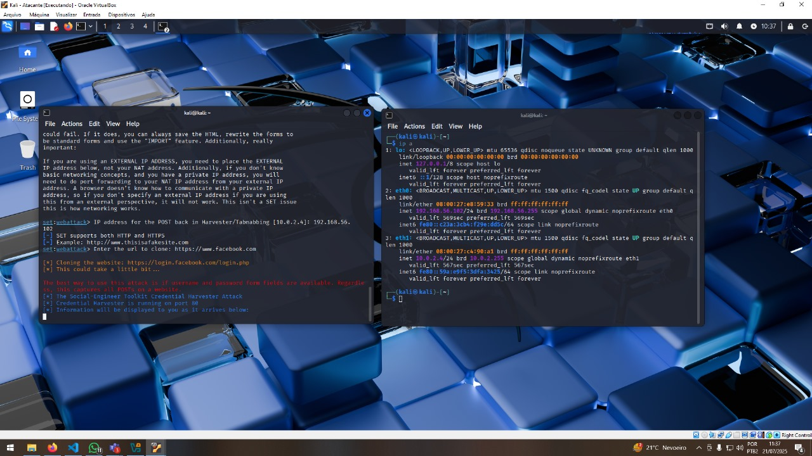

# Análise Técnica: Uso do SEToolkit em Laboratório com Kali Linux e Windows 10

## Objetivo

Relatar tecnicamente a experiência com o SEToolkit em laboratório virtual, destacando:

- Limitações da ferramenta
- Problemas com o Windows Defender e rede
- Clonagem bem-sucedida (Google)
- Alternativas modernas para coleta de credenciais
- Passo a passo visual com imagens do laboratório

---

## Ambiente do Laboratório

- Host: Windows 10 Pro
- Virtualizador: VirtualBox
- Máquinas Virtuais:
  - Kali Linux 2024.1 (modo atacante)
  - Windows 10 (modo vítima)

Configuração de Rede:
- Adaptador Host-Only + NAT (acesso externo opcional)


---

## Configuração de Rede no VirtualBox

Passo 1: Acesse as configurações da VM (Kali)

Passo 2: Configure os adaptadores


Adaptador 1: Host-Only  

Cria rede isolada entre Kali e Windows


Adaptador 2: NAT  
Permite acesso à internet para atualizações de pacotes (opcional)


---

## Teste de Conectividade

Com Windows Defender ativado:
- Ping não retorna resposta (ICMP bloqueado)
- Dificulta uso de ferramentas como nmap, ping ou arp-scan


Com Windows Defender desativado:
- Respostas ao ping funcionam normalmente
- Reconhecimento da máquina vítima pela rede facilitado


---

## Passo a Passo: Clonando Site com SEToolkit

1. Abra o terminal no Kali Linux

2. Execute o comando:

```
sudo setoolkit
```

3. Navegue pelos menus:

```
1) Social-Engineering Attacks
2) Website Attack Vectors
3) Credential Harvester Attack Method
2) Site Cloner
```

4. Informe o IP do Kali (interface Host-Only)

5. Insira a URL a ser clonada (ex: https://accounts.google.com)




---

## Resultado da Clonagem (Bem-sucedido com Google)

Após a vítima acessar a URL clonada e preencher os campos:

- Página falsa do Google exibida no navegador da vítima
- Credenciais coletadas no terminal do Kali


---

## Limitações do SEToolkit

- Sites modernos utilizam HSTS (HTTP Strict Transport Security)
- Clonagem de Facebook, Instagram e outros é bloqueada por padrão
- Navegadores redirecionam automaticamente para HTTPS
- Apenas a página do Google funcionou parcialmente


---

## Alternativas Técnicas Recomendadas

| Ferramenta   | Finalidade                           | Complexidade | Efetividade |
|--------------|---------------------------------------|--------------|-------------|
| Evilginx2     | Phishing com proxy reverso e tokens   | Alta         | Alta        |
| Gophish       | Plataforma para campanhas educativas  | Média        | Alta        |
| BeEF          | Exploração e injeção em navegadores   | Média        | Média       |
| Página Manual | HTML/PHP simulando tela de login      | Baixa        | Média       |

---

## Conclusão

O SEToolkit ainda possui utilidade introdutória, mas não é mais eficaz com os mecanismos modernos de segurança dos navegadores e sistemas operacionais. Navegadores atuais bloqueiam conteúdos HTTP não seguros, dificultando simulações realistas. Mesmo assim, com configurações específicas e foco educacional, ele pode ser usado como ponto de partida.

Importante: todos os testes foram realizados em laboratório controlado, com finalidades exclusivamente didáticas.

---

## Estrutura Sugerida de Pastas

```
Challenge_Phising/
├── README.md
├── prints/
│   ├── def_ativo.jpg
│   ├── def_ativo2.jpg
│   ├── def_desa.jpg
│   ├── face.jpg
│   ├── google.jpg
│   ├── rede_config1.jpg
│   ├── rede_config2.jpg
│   └── setoolkit.jpg
```
